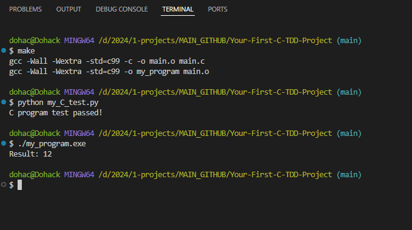
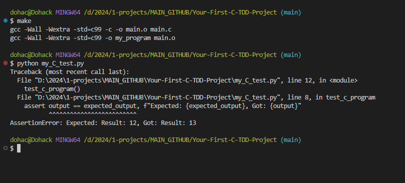

# Your-First-C-TDD-Project: Simple Build System with TDD Approach

## Overview

Your-First-C-TDD-Project exemplifies Continuous Test-Driven Development by showcasing a simple addition test in C, seamlessly integrated with Python for automated testing and managed through efficient Makefiles, fostering an iterative and robust development process.

This project demonstrates a simple build system for a C program using a Makefile and incorporates a basic Test-Driven Development (TDD) approach. The project includes the following components:

- `main.c`: Main C source code file with a simple program.
- `main.h`: Header file declaring functions used in `main.c`.
- `my_C_test.py`: Python test script for testing the C program's functionality.
- `Makefile`: Makefile to automate the compilation and building process.

## File Descriptions

1. **main.c**
   - Contains the main C program with a `main` function and an `add` function.
   - The `main` function calls the `add` function to perform addition.

2. **main.h**
   - Header file declaring the `add` function for use in `main.c`.
   - Ensures proper function declaration and separation of concerns.

3. **my_C_test.py**
   - Python script for testing the C program's functionality.
   - Uses the `subprocess` module to run the compiled C program and check its output.
   - Implements a simple test (`test_c_program`) to validate the `add` function's correctness.

4. **Makefile**
   - Defines compiler options (`CC`, `CFLAGS`) for GCC.
   - Specifies source files (`SRC`) and object files (`OBJ`).
   - Contains rules to compile C source files, build the executable, and clean up generated files.

## Test Objectives

1. **C Program Functionality Testing:**
   - Verify that the C program performs addition correctly.
   - Test Method: The Python script `my_C_test.py` runs the compiled C program (`my_program`) and checks if the addition result is as expected.

    

2. **Testing Failure Scenarios:**
   - To demonstrate test failures, a deliberate error was introduced in the C code (`main.c`).
   - The `add` function in `main.c` was modified to produce an incorrect result.
   - Running the Python test script `my_C_test.py` after compiling the modified C code results in a test failure due to the intentional error.

   **Example Output of Failed Test:**
   ```plaintext
   Traceback (most recent call last):
     File "my_C_test.py", line 12, in <module>
       test_c_program()
     File "my_C_test.py", line 8, in test_c_program
       assert output == expected_output, f"Expected: {expected_output}, Got: {output}"
   AssertionError: Expected: Result: 12, Got: Result: 13
   ```

    

## How It Works

1. **Compilation and Building:**
   - The Makefile automates the compilation and building process.
   - Compiles C source files into object files (`main.o`).
   - Links object files to create the executable (`my_program`).

2. **Test-Driven Development (TDD) Approach:**
   - Python script `my_C_test.py` follows a TDD approach.
   - Writes a failing test (`test_c_program`) that checks the addition result.
   - Implements the C code (`main.c`) to pass the test.
   - Runs the test to validate the functionality.

## Rationale

- **Automation with Makefile:**
  - Saves time and effort by automating the compilation process.
  - Defines compiler options and rules for compiling, building, and cleaning.

- **Test-Driven Development (TDD):**
  - Ensures code correctness by writing tests before implementing code.
  - Improves code quality, encourages modular design, and supports incremental development.

- **Separation of Concerns:**
  - Header files (`main.h`) separate function declarations from implementations.
  - Test scripts (`my_C_test.py`) focus on testing without cluttering the main codebase.

- **Clear Test Objectives:**
  - Enhances code reliability and facilitates future modifications.

## Folder Structure

```
project_folder/
│
├── main.c
├── main.h
├── my_C_test.py
└── Makefile
```

## Usage

1. Clone the repository.
2. Navigate to the project directory.
3. Compile the C code using `make`.
4. Run tests using `python my_C_test.py`.

## Conclusion

This README.md provides an overview of the project's structure, objectives, and rationale for using specific files and approaches. It emphasizes automation, TDD principles, separation of concerns, and clear test objectives for maintaining code quality and functionality validation.

## What Next?

 10 different types of tests that can be conducted using Python:

1. **Unit Tests:** Test individual units or components of the code in isolation.
2. **Integration Tests:** Test how different components/modules work together.
3. **Functional Tests:** Test the functionality of the entire system or application.
4. **Regression Tests:** Test to ensure that new code changes do not break existing functionalities.
5. **Performance Tests:** Test the performance and efficiency of the code under various conditions.
6. **Security Tests:** Test for vulnerabilities and security risks in the code.
7. **Stress Tests:** Test the behavior of the system under high load or stress conditions.
8. **Boundary Tests:** Test the behavior of the code at boundary conditions and edge cases.
9. **Compatibility Tests:** Test the compatibility of the code with different platforms or environments.
10. **Usability Tests:** Test the usability and user experience aspects of the application or system.

These are just a few examples of the types of tests that can be conducted using Python. Depending on the nature of your project, you may choose to conduct one or more of these tests to ensure the quality, reliability, and performance of your codebase.